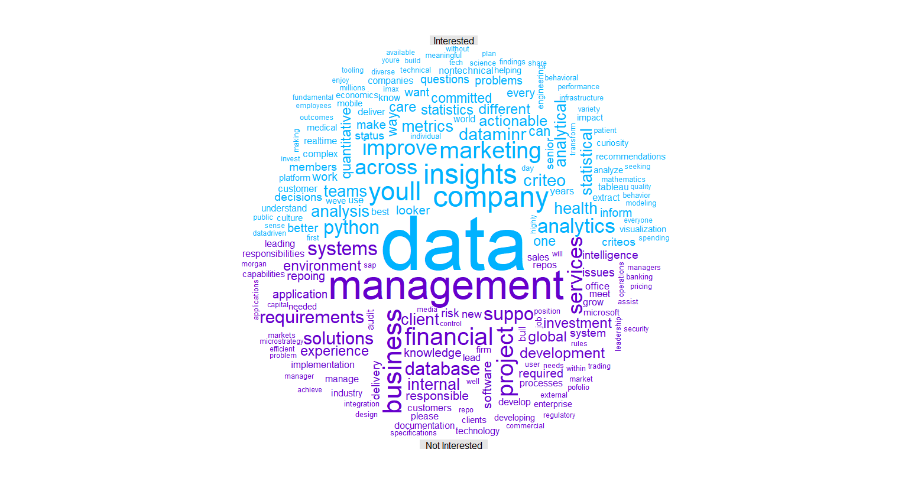

## Objective, Steps
This project is about scraping data from glassdoor and using it to build a personal job recommendation. A different script is set up to run the following part I, II and V, and the script is scheduled to run daily/weekly using Windows Task Scheduler (alternatively, "taskscheduleR" package). 

Part I of the script is about web scraping. First, I need to identify the url (such as search key terms, location, salary, date range, etc) as a pointer for web scraping. Each of these url(s) would include multiple jobs and associated job id posted. Second, I need to extract info for each of these jobs, including salary, review, company name, url, job id, etc. Subsequently, I extract company names for all these jobs. I need to query these company info (such as headquarter, company size, revenue, etc) by searching on google. Next, I will clean (mostly by removing incomplete data set and performing some stringr operations) the unstructural data set(s) and put everything together. I will have two data sets/frames, i.e. jobDf, companyDf. I will need to merge them together by jobListingId. Any job that has incomplete data (such as missing salary or company info) is removed. The exercise of this project is to rely on a complete data set to make classification/recommendation.

Part II, I perform a simple change-data-capture (CDC). Above steps describe a simple ETL (extract, transform & load) process. Whenever the script is run on scheduler (say, daily), a txt file for jobDf and a txt file for companyDf are saved locally. Each of these txt files' names is associated with a timestamp. Plus, an aggregated data frame (saved as a single object as a .RDS file) is always updated. That means, each of these txt files (for job or company) is appended whenever the script is run. I don't lose any data - I keep each txt file when the script is run, I also append them to the aggregated table, but I do update, delete and insert based on jobListingId and latest company info. Not just simply appending/adding data to the existing aggregated table. In other words, I do change-data-capture (CDC) for two simple reasons: 1) I avoid seeing the same jobs inserted multiple times in the latest (aggregated) data frame, and 2) I update job posting and company info based on latest data (same job can be posted multiple times, as well as company info can vary across times). When I am ready to analyze the data, I merge the aggregated jobDf and companyDf together. I will have a single, complete data frame (I name it as jpr - job-posting-recommendation) to work with and one row would represent a single job posted.

Part III, I start to anaylze data here. First, I manually review the data that I collect. In this case, I have collected 200 jobs. Each of these is reviewed and flagged (1/0) - whether I would be interested in it or not. Subsequently, I load the data (jobListingId, flag) back and merge it with the jpr data frame to form a new data frame, i.e. newDf. I clean the job description and turn it into a document term matrix (dtm). I split the newDf into train and test sets. I combine the dtm with other quantitative variables that I collect for each job. These variables include estimated salary, company review (from 0 to 5), company size, and revenue. I need to drop "industry" because I do not have a big enough data set, i.e. some industries included in the train set cannot be found in the test set, thus a classification model built using the train set would fail to apply on a test set. At the end, I build a logistic regression model using these quantitative variables along with the job descriptions turned into a dtm (I set a criterion - only words appear 10 times or more in the corpus of job descriptions would be included in the final classification model). The results indicate sensitivity is 60%, specificity is 70%, precision is 28.6% and total accuracy is 68.3%. Various algorithm is also tried, including support-vector-machine (SVM) and Naive Bayes, but both perform very poorly and not included for display here. A larger data set is recommended. 

Part IV, I visualize the job descriptions using word cloud. I create a single word cloud featuring jobs that I am interested in, and also I create a comparison cloud to feature and compare jobs that I am interested in versus jobs that I am not. The visualization is satisfying, especially the comparison cloud can tease out keywords from the two separate corpuses. 

Part V, finally, I demonstrate how to send out an email notification in R. In theory, I can classify jobs that I am potentially interested in (by applying the model to the jobs that I scrap daily or weekly), and then send a notification with attachment(s) via email to myself. This step is omitted and not shown here, because I have not collected large enough data set to provide/develop any useful model for job recommendation. Example of seting up an email with attachment is shown here (without username or password displayed). In addition, I need to create a simple task.bat file to instruct Windows where to find and run my script when I set up the Task Scheduler.


 
PART I : **WEB SCRAPING**
	- Step 1 : get links
	- Step 2 : get job info for each link
	- Step 3 : jobDf
	- Step 4 : companyDf

PART II : **CHANGE-DATA-CAPTURE (CDC)**
	- Step 5.1 : update (delete), insert
	- Step 5.2 : merge

PART III : **ANALYSIS BEGINS!**
	- Step 6 : reivew and flag jobs
	- Step 7 : document term matrix
	- Step 8 : split into train, test
	- Step 9 : classification - logistic regression

PART IV : **WORD CLOUD**
	- Step 10.1 : code 
	- Step 10.2 : overall word cloud
	- Step 10.3 : comparison cloud

PART V : **SET UP**
	- Step 11 : email notification
	- Step 12 : Windows Task Scheduler


### Step 0 : load packages
```{r setup, include = T, message = F, warning = F}
knitr::opts_chunk$set(echo = TRUE)

packages <- c("tidyverse", "rvest", "RCurl", "plyr", "wrapr", "Hmisc", "sqldf", "kableExtra", "tidytext", "tm", "e1071", "pROC", "wordcloud")
invisible( lapply(packages, function(x) library(x, character.only = T, verbose = F, quietly = T)) )
```


### PART I : WEB SCRAPING { .tabset}

#### Step 1 : get links
```{r step_1, eval = F}
# identify the url(s) with the necessary parameters, such as job title, salary, distance, etc.
# data analyst, New York, 100k USD, past 7 days
da <- "https://www.glassdoor.com/Job/jobs.htm?sc.keyword=data%20analyst&locT=C&locId=1132348&locKeyword=New%20York,%20NY&jobType=fulltime&fromAge=7&minSalary=100000&includeNoSalaryJobs=true&radius=-1&cityId=-1&minRating=0.0&industryId=-1&companyId=-1&applicationType=0&employerSizes=0&remoteWorkType=0"

# business intelligence, New York, 100k USD, past 7 days
bi <- "https://www.glassdoor.com/Job/jobs.htm?sc.keyword=business%20intelligence&locT=C&locId=1132348&locKeyword=New%20York,%20NY&jobType=fulltime&fromAge=7&minSalary=100000&includeNoSalaryJobs=true&radius=-1&cityId=-1&minRating=0.0&industryId=-1&companyId=-1&applicationType=0&employerSizes=0&remoteWorkType=0"

# get the job links and jobListingId from the above urls
da_links <- read_html(da) %>%
        # html_nodes(".compactStars , .small , .empLoc div , .jobLink") %>%
        html_nodes(".jobLink") %>%
        html_attr("href") %>%
        na.omit %>%
        as.data.frame %>%
        dplyr::rename("links" = ".") %>%
        dplyr::mutate( links = paste0("https://www.glassdoor.com", as.character(links)),
                jobListingId = stringr::str_extract_all(links, pattern = "jobListingId=[0-9]+") %.>% 
                        gsub(pattern = "jobListingId=", replacement = "", x = .) ) %>%
        arrange(., jobListingId, desc(links)) %>%
        # many of these contain the same identical job posting but with different urls, we need to take them out
        group_by(jobListingId) %>%
        dplyr::mutate( id = row_number() ) %>%
        ungroup %>%
        dplyr::filter(id == 1) %>%
        select(links, jobListingId)

bi_links <- read_html(bi) %>%
        # html_nodes(".compactStars , .small , .empLoc div , .jobLink") %>%
        html_nodes(".jobLink") %>%
        html_attr("href") %>%
        na.omit %>%
        as.data.frame %>%
        dplyr::rename("links" = ".") %>%
        dplyr::mutate( links = paste0("https://www.glassdoor.com", as.character(links)),
                       jobListingId = stringr::str_extract_all(links, pattern = "jobListingId=[0-9]+") %.>% 
                               gsub(pattern = "jobListingId=", replacement = "", x = .) ) %>%
        arrange(., jobListingId, desc(links)) %>%
        # many of these contain the same identical job posting but with different urls, we need to take them out
        group_by(jobListingId) %>%
        dplyr::mutate( id = row_number() ) %>%
        ungroup %>%
        dplyr::filter(id == 1) %>%
        select(links, jobListingId)

# append the df
links <- rbind(da_links, bi_links) %>% distinct  # a data frame with unique job listing id and associated url
```


#### Step 2 : get job info for each link
```{r step_2, eval = F}
# create extract function 
extract_job_info <- function(link, jobListingId) {
        read_html(link) %>% 
        html_nodes(".nowrap, .ratingNum , .salEst , .desc , #HeroHeaderModule .strong") %>%
        html_text %>%
        as.data.frame %>%
        dplyr::rename("job" = ".") %>%
        t %>%
        as.data.frame %>% 
        dplyr::mutate(jobListingId = jobListingId)        
}

# must use purrr::possibly - fail-safe approach
extract_job_info <- purrr::possibly(extract_job_info, otherwise = NA_real_)

# create an empty list
jobList <- vector(mode = "list", length = nrow(links))

# scrape the job info and write each into the list before complying into a data.frame 
system.time( lapply(1:length(jobList), function(x){
        jobList[[x]] <<- extract_job_info(links$links[x], links$jobListingId[x])
        } ) %.>% invisible(.) )

# remove NA result first
na <- lapply(1:length(jobList), function(x) is.na(jobList[x])) %>% unlist %>% which
stay <- c(1:length(jobList))[1:length(jobList) %nin% na]

jobList <- jobList[stay]

# there's missing data in different job postings
# some have 4 or 5 columns, while most have 8 (complete set)
jobListSummary <- data.frame(row = 1:length(jobList), length = NA)

lapply(1:length(jobList), function(x) {
        jobListSummary$length[x] <<- length(jobList[[x]])
}) %.>% invisible(.)

uniqueLength <- unique(jobListSummary$length)
lengthUniqueLength <- length(uniqueLength)
uniqueList <- vector(mode = "list", length = lengthUniqueLength)

for(i in 1:lengthUniqueLength){
        uniqueList[[i]] <- sqldf::sqldf(
                sprintf('select row from jobListSummary where length = %d', uniqueLength[i]) 
        )
}

uniqueList <- lapply(1:length(uniqueList), function(x){
        unlist(uniqueList[[x]]) %>% as.vector
})

# store each set of data into a data.frame by the length of column
jobListDf <- vector(mode = "list", length = lengthUniqueLength)

for(i in 1:lengthUniqueLength){
        jobListDf[[i]] <- jobList[c(uniqueList[[i]])]
}

# jobListDf is now a list of lists (by length of column) in which each list contains a data.frame for each job
# str(jobListDf); summary(jobListDf)
# let's reduce it to a number of list by length of column and make each list a data.frame (combining all jobs inside that list)
putTogether <- function(x){
        plyr::ldply(x, data.frame)
}

jobListDf <- lapply(jobListDf, putTogether)
```


#### Step 3 : jobDf
```{r step_3, eval = F}
### CAUTION : there are multiple lists - some have 9 columns, whereas some have only 5 or 6 ###
# create and save (locally) a data frame for jobs
# let's just look at the complete set (9 columns)
# because the other are missing critical information that we need, e.g. review, salary

extractListNumber <- lapply(1:length(jobListDf), function(x){
        length(jobListDf[[x]]) == 9}) %>% 
        unlist %.>%
        which(. == T)

jobDf <- jobListDf[[extractListNumber]] %>%
        dplyr::mutate( title = as.character(V1),
                       company = as.character(V2) %>% 
                               stringr::str_trim(.),
                       last_updated = stringr::str_extract_all(V3, pattern = "Today|[0-9]+") %>% 
                               unlist %.>% 
                               ifelse(. == "Today", 0, .) %>%
                               as.numeric %.>%
                               lapply(1:length(.), function(x){
                                       Sys.Date() -.[x]
                               }) %>% 
                               unlist %.>%
                               as.Date(., origin = "1970-01-01"), 
                       glassdoor_est = as.character(V4),
                       review = stringr::str_extract_all(V6, pattern = "[0-9]\\.[0-9]") %>% 
                               as.numeric,
                       salary_est = gsub(pattern = ",", replacement = "", V7) %>%
                               stringr::str_extract_all(., pattern = "[0-9]+") %>%
                               unlist %>%
                               as.numeric,
                       salary_est = salary_est / 1000,
                       jobListingId = as.character(jobListingId),
                       description = as.character(V8),
                       run_time = Sys.time() ) %>%
        tidyr::separate(., glassdoor_est, into = c("salary_min_est", "salary_max_est"), sep = "-") %>%
        mutate( salary_min_est = stringr::str_extract_all(salary_min_est, pattern = "[0-9]+") %>%
                        unlist %>%
                        as.numeric,
                salary_max_est = stringr::str_extract_all(salary_max_est, pattern = "[0-9]+") %>%
                        unlist %>%
                        as.numeric ) %>%
        # inner join it back with "links" to get url pairing with jobListingId
        dplyr::inner_join(., links, by = "jobListingId") %>%
        dplyr::rename(url = links) %>%
        # pull together a list of following columns
        select(jobListingId, title, company, last_updated, 
               salary_min_est, salary_max_est, salary_est, 
               review, url, run_time, description) %>%
        arrange(company, title, last_updated)

# setwd to data/job
currentwd <- getwd()
setwd("../"); setwd("data/job")

# save as txt
run_time <- jobDf$run_time %>% unique %.>% gsub(pattern = ":", replacement = "", x = .)
filename <- paste0("jobDf_", run_time, ".txt", sep = "")
write.table(jobDf, file = filename, sep = "\t", row.names = F, append = F)

# reset wd
setwd(currentwd)
```


#### Step 4 : companyDf
```{r step_4, eval = F}
# create and save (locally) a data frame for companies
# write a function to search via google for the url pointing to the glassdoor overview database for a company
# wish I can just get an API to query against glassdoor/Indeed database
overview <- function(company){
        entity = company
        search = "glassdoor company overview"
        url = URLencode(paste0("https://www.google.com/search?q=", paste0(entity, search, sep = " ")))
        
        # return top pages result
        cite <- read_html(url) %>% 
                html_nodes("cite") %>%  # change any node you like, e.g. cite
                html_text() %>%
                as.data.frame(., stringsAsFactors = F) %>%
                dplyr::mutate(row = row_number()) %>%
                dplyr::rename(url = ".")
        
        # sql hack - return only the "lower(url) like '%glassdoor%overview/working-at%'"
        overview_cite_select <- sqldf("select url 
                                from (
                                select url, min(row) as flag 
                                from ( select url, row 
                                        from cite 
                                        where lower(url) like '%glassdoor%overview/working-at%' ) x 
                                group by url
                                ) y") %>% as.character
        
        # scrape the company overview
        overview <- read_html(overview_cite_select) %>%
                html_nodes(".value , .website") %>%
                html_text %>%
                # dplyr::rename("overview" = ".") %>%
                t %>%
                as.data.frame %>%
                dplyr::mutate(V0 = company) %>%
                select(., starts_with("V"))
        
        return(overview)
}

# must use purrr::possibly - fail-safe approach
overview <- purrr::possibly(overview, otherwise = NA_real_)

# start scraping from the list of companies from jobDf
companies <- vector(mode = "list", length = length(unique(jobDf$company)))
names(companies) <- jobDf$company %>% unique 
companies <- lapply(1:length(companies), function(x) companies[[x]] <- names(companies)[x])
# system.time( companies <- lapply(1:length(companies), function(x) overview(companies[[x]])) )
system.time( companies <- purrr::map(1:length(companies), function(x) overview(companies[[x]])) )  # a little faster

# remove NA result first
remove <- lapply(1:length(companies), function(x) is.na(companies[x])) %>% unlist %>% which
keep <- c(1:length(companies))[1:length(companies) %nin% remove]

# extract only V0:V7 columns
extract <- function(x){
        x <- dplyr::select(x, V0, V1, V2, V3, V4, V5, V6, V7)
        return(x)
}

# must use purrr::safely - fail-safe approach
extract_safely <- purrr::safely(extract, otherwise = NA_real_)

# extract, combine into a single df, and then rename columns
companyDf <- purrr::map(companies[keep], extract_safely) %.>%
        purrr::transpose(.)

companyDf <- companyDf$result %>%
        plyr::ldply(., data.frame)

names(companyDf) <- c("company", "website", "headquarters", "size",
                      "founded", "type", "industry", "revenue")

# change Factor to Chr, use str_trim to remove white space
companyDf <- companyDf[, 1:8]  # have to subset first; dplyr::select does not allow NA column
companyDf <- companyDf[complete.cases(companyDf), ] %>%
        dplyr::mutate( website = as.character(website) %>% stringr::str_trim(.),
                       headquarters = as.character(headquarters) %>% stringr::str_trim(.),
                       size = as.character(size) %>% stringr::str_trim(.),
                       founded = stringr::str_extract_all(founded, "[0-9]+") %>% as.numeric,
                       type = as.character(type) %.>%
                               gsub(".*[Pp]rivate.*", "private", .) %.>%
                               gsub(".*[Pp]ublic.*", "public", .) %>%
                               stringr::str_trim(.),
                       industry = as.character(industry) %>% stringr::str_trim(.),
                       revenue = as.character(revenue) %>% stringr::str_trim(.),
                       run_time = Sys.time() )

# complete.cases() again, b/c of some misplacing columns
# some jobs have 10 columns and there's some mismatch when we manually pull V1:V7 columns
# for example, "founded" value would be misplaced in the "type" column
# an imperfect and temporary solution is to do complete.cases() one more time to rid the NA
companyDf <- companyDf[complete.cases(companyDf), ]

# setwd to data/company
setwd("../"); setwd("data/company")

# save as txt
run_time2 <- companyDf$run_time %>% unique %.>% gsub(pattern = ":", replacement = "", x = .)
filename2 <- paste0("companyDf_", run_time2, ".txt", sep = "")
write.table(companyDf, file = filename2, sep = "\t", row.names = F, append = F)

# reset wd
setwd(currentwd)
```
***


### PART II : CHANGE-DATA-CAPTURE (CDC) { .tabset}

#### Step 5.1 : update (delete), insert
```{r step_5.1, eval = F}
setwd("../"); setwd("data")

# load the _agg tables
jobDf_agg <- readRDS(file = "jobDf_agg.RDS")
companyDf_agg <- readRDS(file = "companyDf_agg.RDS")

#######################
# delete, insert, save
# job
jobListingId_agg <- jobDf_agg$jobListingId   
jobListingId_now <- jobDf$jobListingId

del <- jobListingId_agg[jobListingId_agg %in% jobListingId_now]

jobDf_agg <- jobDf_agg %>%
        dplyr::filter(jobListingId %nin% del) %.>%  # delete
        dplyr::bind_rows(., jobDf)  # append

saveRDS(jobDf_agg, file = "jobDf_agg.RDS")  # save

# company
company_agg <- companyDf_agg$company   
company_now <- companyDf$company

del2 <- company_agg[company_agg %in% company_now]

companyDf_agg <- companyDf_agg %>%
        dplyr::filter(company %nin% del2) %.>%  # delete
        dplyr::bind_rows(., companyDf)  # append

saveRDS(companyDf_agg, file = "companyDf_agg.RDS")  # save
#######################

# reset wd
setwd(currentwd)
```

#### Step 5.2 : merge
```{r step_5.2, eval = F}
### CAUTION : there is always missing data for some companies overview ###
# let's merge (instead of left join) jobDf_agg and companyDf_agg together

jpr <- merge(jobDf_agg, companyDf_agg, by = "company") %>%
        # filter job titles that are not relevant
        dplyr::filter(title %in% title[!grepl("(architect|software|engineer|director)", title, ignore.case = T)]) %>%
        # filter by job posting last_updated within past 14 days
        # dplyr::filter(last_updated > Sys.Date() -14) %>%
        # filter out duplicated jobListingId - this happens b/c same job with same Id can have different urls
        group_by(jobListingId) %>%
        dplyr::mutate(row = row_number()) %>%
        ungroup %>%
        dplyr::filter(row == 1) %>%
        select(jobListingId, title, company, last_updated, salary_min_est, salary_max_est, salary_est, review, url,
               website, headquarters, size, founded, type, industry, revenue, description) %>%
        arrange(company, title, last_updated) 

# jpr %>% arrange(., desc(last_updated)) %>% View

# output into txt, for manually review
# write.table(jpr, file = "output.txt", row.names = F)
```
***


### PART III : ANALYSIS BEGINS! {.tabset} 

#### Step 6 : reivew and flag jobs
```{r step_6, eval = T}
# manully go through the short list (200 jobs) - flag out those that I am interested in
# merge it back and create a new data frame (newDf) for modeling
# I saved and pushed it to github account - that is a csv file that contains 200 jobs
newDf <- read.table("https://raw.githubusercontent.com/myvioletrose/job_posting_recommendation/master/data/newDf.csv", header = T, stringsAsFactors = T)
newDf <- newDf %>% dplyr::mutate(description = as.character(description))
str(newDf)

head(newDf) %>% kable %>% 
        kable_styling(bootstrap_options = c("striped", "hover", "condensed", "responsive"), full_width = F)

# create a description data frame for text mining
description <- newDf %>% dplyr::select(jobListingId, flag, description)
table(description$flag)  # I am interested in 60 out of 200 jobs scrapped from glassdoor

### the goal is to combine quantitative variables (like estimated salary, company revenue) with text description of a job to predict my potential interest in a job when it's getting posted!
```


#### Step 7 : document term matrix
```{r step_7, eval = T, include = T, message = F, warning = F}
### cleanup steps ###

# first put the corpus in tm format
descriptionClean <- Corpus(VectorSource(description$description))

# clean up
descriptionClean <- tm_map(descriptionClean, content_transformer(tolower))
descriptionClean <- tm_map(descriptionClean, removeWords, stopwords())
descriptionClean <- tm_map(descriptionClean, stripWhitespace)
descriptionClean <- tm_map(descriptionClean, removePunctuation)

# convert it into a dtm (row per document, column per word)
dtm <- DocumentTermMatrix(descriptionClean)
# inspect(dtm)

# set frequency filter, i.e. only include words that appear f or more times in the whole corpus
f = 10
features <- findFreqTerms(dtm, f)
```


#### Step 8 : split into train, test
```{r step_8, eval = T}
# set index : split by 70% vs 30%
set.seed(1234)
index <- sample(1:dim(description)[1], .7 * dim(description)[1])

# step 1 : split original corpus into train and test sets, each set contains the "flag" (dependent variable)
train_step_1 <- description[index, ]
test_step_1 <- description[-index, ]

# step 2 : dummify the "term" (or word) columns
train_step_2 <- descriptionClean[index] %>% 
        DocumentTermMatrix(., list(global = c(2, Inf), dictionary = features)) %>%
        apply(MARGIN = 2, function(x) x <- ifelse(x >0, 1, 0)) %>%
        as.data.frame

test_step_2 <- descriptionClean[-index] %>% 
        DocumentTermMatrix(., list(global = c(2, Inf), dictionary = features)) %>%
        apply(MARGIN = 2, function(x) x <- ifelse(x >0, 1, 0)) %>%
        as.data.frame

# step 3 : put step 1 and 2 together
train <- cbind(flag = factor(train_step_1$flag), 
               jobListingId = train_step_1$jobListingId,
               train_step_2) %>% as.data.frame

test <- cbind(flag = factor(test_step_1$flag), 
              jobListingId = test_step_1$jobListingId,
              test_step_2) %>% as.data.frame

# FINAL step : merge back with newDf
# minus "industry" because we don't collect enough data
# the train data set is missing some industries in the test data set
newDf_train_subset <- newDf[index, ] %>% select(-c(description, flag, industry))
newDf_test_subset <- newDf[-index, ] %>% select(-c(description, flag, industry))

train <- merge(train, newDf_train_subset, by = "jobListingId") %>% dplyr::select(-jobListingId)
test <- merge(test, newDf_test_subset, by = "jobListingId") %>% dplyr::select(-jobListingId)
```


#### Step 9 : classification - logistic regression
```{r step_9, eval = T, include = T, message = F, warning = F}
# build a model
fit_lr <- glm(flag ~., train, family = "binomial")  # summary(fit_lr)

# fit a prediction
fit_lr_pred <- predict(fit_lr, newdata = test[, -1], type = "response")

# classification outcome
ftable(test$flag, fit_lr_pred > 0.5) -> table_lr
table_lr

table_lr %>% prop.table(., margin = 1)*100 -> accuracy_lr
round(accuracy_lr, 1)

tp <- 6
fp <- 15
tn <- 35
fn <- 4

sensitivity <- tp / (tp + fn)  # equivalent to recall
specificity <- tn / (tn + fp)
precision <- tp / (tp + fp) 
total_accuracy <- (tp + tn) / sum(tp, fp, tn, fn)

metric <- c("sensitivity", "specificity", "precision", "total_accuracy")
purrr::map2(c(sensitivity, specificity, precision, total_accuracy), c(1:4), function(x, y) { paste0(metric[y], " is ", round(x * 100, 1), "%") }) %>% unlist

# ROC curve
fit_lr_pred_roc <- roc(flag ~ fit_lr_pred, data = test)
plot(fit_lr_pred_roc, main = "ROC curve of logistic regression model")
```


### PART IV : word cloud { .tabset}

#### Step 10.1 : code
```{r step_10.1, eval = F}
### let's visualize solely jobs that I am interested in by using word cloud

####### overall word cloud #######

# clean text first
clean.text = function(x)
{
        # tolower
        x = tolower(x)
        # remove rt
        x = gsub("rt", "", x)
        # remove at
        x = gsub("@\\w+", "", x)
        # remove punctuation
        x = gsub("[[:punct:]]", "", x)
        # remove numbers
        x = gsub("[[:digit:]]", "", x)
        # remove links http
        x = gsub("http\\w+", "", x)
        # remove tabs
        x = gsub("[ |\t]{2,}", "", x)
        # remove blank spaces at the beginning
        x = gsub("^ ", "", x)
        # remove blank spaces at the end
        x = gsub(" $", "", x)
        return(x)
}

overall <- tm::Corpus(VectorSource(description$description[description$flag == 1])) %>%
        clean.text 

set.seed(8321)
wordcloud(overall, 
          min.freq = 30, 
          colors = brewer.pal(8, "RdBu"))


####### comparison cloud #######

# clean, transform into tdm first
interested <- description %>% filter(flag == 1) %>% select(description) %>%
        clean.text %>%
        paste(., collapse = " ")

not_interested <- description %>% filter(flag == 0) %>% select(description) %>%
        clean.text %>%
        paste(., collapse = " ")

all <- c(interested, not_interested) %>%
        removeWords(., c(stopwords("english"))) %>%
        VectorSource %>%
        Corpus

tdm <- TermDocumentMatrix(all) %>% as.matrix
colnames(tdm) <- c("Interested", "Not Interested")

# comparison cloud #
set.seed(8321)
comparison.cloud(tdm,
                 title.size = 1,
                 random.order = FALSE,
                 # colors = c("#00B2FF", "red", "#FF0099", "#6600CC"),
                 # colors = c("#00B2FF", "#6600CC"),
                 colors = c("green", "red"),
                 max.words = 200)
```


#### Step 10.2 : overall word cloud 
```{r step_10.2, echo = FALSE, fig.cap = "Jobs that I am interested in", out.width = '100%'}

```


#### Step 10.3 : comparison cloud 
```{r step_10.3, echo = FALSE, out.width = '100%'}

```

The comparison cloud is pretty accurate. I am more interested in insights, marketing, analytics, python, experienced in visualization (such as Looker and Tableau are both displayed on top), whereas I am less interested in finance, investment, banking or management (or manager role), and it's correct that I don't have any experience in microstrategy, software implementation, design or integration.


### PART V : SET UP { .tabset}

#### Step 11 : email notification
```{r step_11, eval = F}
library(mailR)
sender <- "myvioletrose@gmail.com" 
recipients <- c("myvioletrose@gmail.com") 
# username <- "xyz"
# password <- "xyz"

email <- mailR::send.mail(from = sender,
                   to = recipients,
                   subject = "Jobs that I am interested in",
                   body = "FYI",
                   smtp = list(host.name = "smtp.gmail.com", 
                               port = 465, 
                               user.name = username,
                               passwd = password,
                               ssl = T),
                   authenticate = T,
                   send = T,
                   # attach any file (txt or png)
                   attach.files = c(grep(pattern = "jobs_i_like", dir(), value = T)))
```

#### Step 12 : Windows Task Scheduler
```{r step_12, eval = F}
# create a .bat file (e.g. task.bat) that includes two lines of code
# it is used as a pointer to tell Windows where to find and run your script
@echo off
"C:\Program Files\R\R-3.4.0\bin\R.exe" CMD BATCH "C:\Users\traveler\Desktop\job_posting_recommendation\career_web_scrap.R"
```


